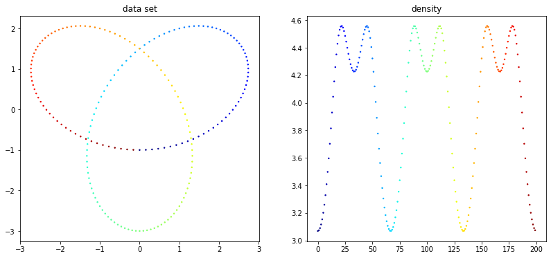
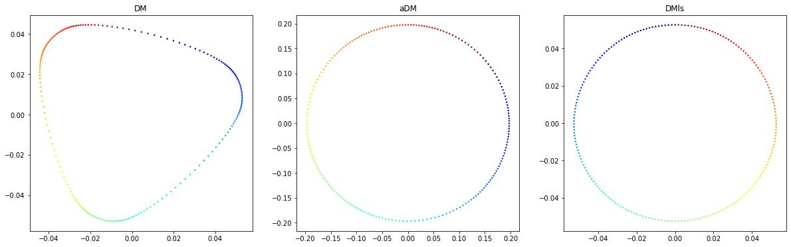
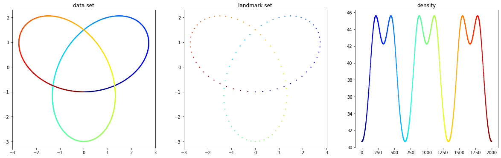
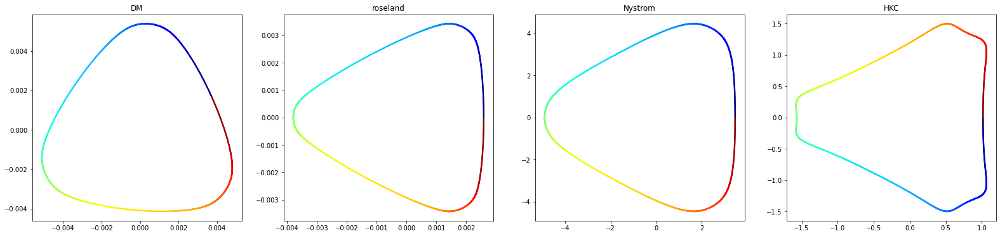
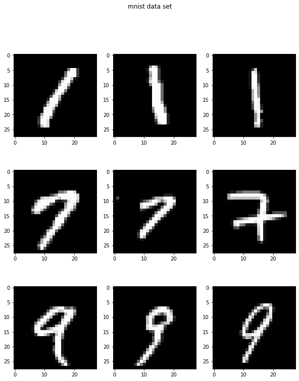
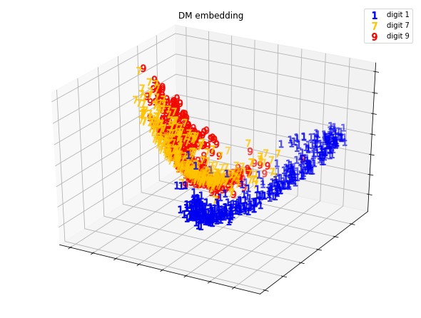
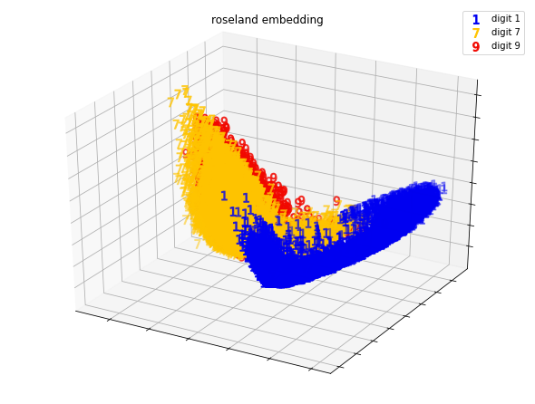
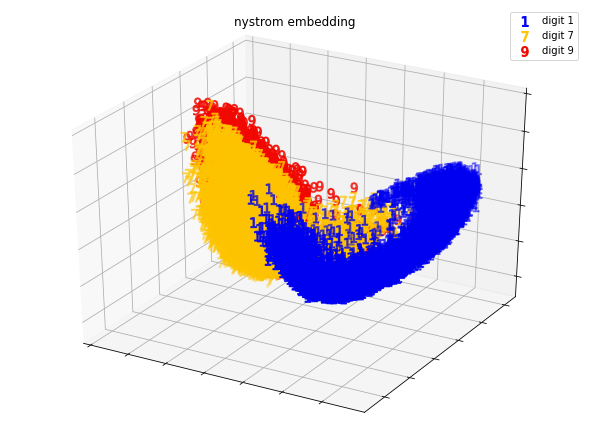

<h1 align="center">Diffusion Maps 2</h1>

<i>Investigate the effects of sampling density and scale of data sets to the diffusion maps.</i>

 

We first state the two main problems of diffusion maps, then investigate methods that solve these problems. 

## Problem discription

1. The spectrum of DM is affected by the sampling density of data points. When the data has nonuniform sampling distribution, DM may not reveal the structures of its underlying manifold. 

2. DM computes the SVD of a symmetric full-rank matrix, which is computational exspensive. Due to this action, we cannot apply DM to reveal structures of massive data sets. 

## Algorithm
This section introduces the algorithms in this repository and display results of some of them. For more details and results of all these algorithms, see folder `Result` and the `.ipynb` files. 

 

:round_pushpin: `test_property.ipynb` 

Studies some properties of diffusion maps using simple data sets. 

 

:round_pushpin: `sampling_density.ipynb` 

Compares the embedding results of diffusion maps (DM) [1] / anisotropic diffusion maps (aDM) [1] / diffusion maps with local scaling (DMls) [2] using designed data sets. These methods (except DM) aim to solve problem 1. See the following demonstration. 

The data set is a three dimensional knot of size 200, which has underlying manifold being a circle. (For clearer view, It is displayed in 2-dimensional space.) It has nonuniform sampling density. 

Left: DM is affected by the sampling density, which generates corners at where is denser.   
Middle: aDM reveals the underlying manifold, also, it preserves the true neighbors of a data points.  
Right: DMls reveals the underlying manifold, but it do not preserve the true neighbors of a data points. (DMls harmonizes the distances of pairwise points in clusters of different local statistics.) 

 

:round_pushpin: `scalability.ipynb` and `scalability_muIDM.ipynb` 

Compare roseland [3] / DM with Nystrom extension [4] / HKC [5] / mu-isometric diffusion maps [6] using designed data sets. These methods aim to solve problem 2. See the following demonstration. 

The data set is a three dimensional knot of size 2000, and the landamrk set constitutes of 100 points uniformly chosen from the data set. 

 Results of roseland and DM with Nystrom extension approximate the DM embedding, whereas result of HKC does not. 

| | DM | roseland | DM with Nystrom extension | HKC |
| :---------------- | :----------------:| :----------------: | :----------------: | :----------------: | 
|Execution time |1.0114 s|0.0571 s|0.0737 s|0.0427 s|

 

:round_pushpin: `scalability_mnist.ipynb` and `scalability_medical_signal.ipynb` 

Compare roseland / DM with Nystrom extension using real-world data sets (the MNIST data set and the medical signals data sets). See the following demonstrations. 

The data set consists of all digits of 1,7, and 9 in the original MNIST data set. It is of size 18956. The landmark points is uniformly chosen from the data points, and the size of landmark set is 84 (=18956^{0.45}).

    
    
    

Left: DM of a small data set of size 1200. (We choose 400 images of each digit to form this data set.)   
Middle: roseland of the data set of size 18956.  
right: DM with Nystrom extension of the data set of size 18956. 

| | roseland | DM with Nystrom extension | 
| :---------------- | :----------------:| :----------------: | 
|Execution time |10.7 s|8.89 s|

 

:round_pushpin: `scalability_addpoint.ipynb` 

Aims to solve problem 2 by gradually construct the embedding of a large data set. We test this possible solution for problem 2 by: computing DM on a small data set, then add data points and extend the embedding using Nystrom extension / modify SVD [7] / split and combine methods. 

## References
[1] Coifman, Ronald R., and Stéphane Lafon. "Diffusion maps." Applied and computational harmonic analysis 21.1 (2006): 5-30.  
[2] Zelnik-Manor, Lihi, and Pietro Perona. "Self-tuning spectral clustering." Advances in neural information processing systems 17 (2004).  
[3] Shen, Chao, Yu-Ting Lin, and Hau-Tieng Wu. "Robust and scalable manifold learning via landmark diffusion for long-term medical signal processing." Journal of Machine Learning Research 23.86 (2022): 1-30.  
[4] Fowlkes, Charless, et al. "Spectral grouping using the Nystrom method." IEEE transactions on pattern analysis and machine intelligence 26.2 (2004): 214-225.  
[5] Haddad, Ali, Dan Kushnir, and Ronald R. Coifman. "Texture separation via a reference set." Applied and Computational Harmonic Analysis 36.2 (2014): 335-347.  
[6] Salhov, Moshe, et al. "Approximately-isometric diffusion maps." Applied and Computational Harmonic Analysis 38.3 (2015): 399-419.  
[7] Brand, Matthew. "Fast low-rank modifications of the thin singular value decomposition." Linear algebra and its applications 415.1 (2006): 20-30.  

